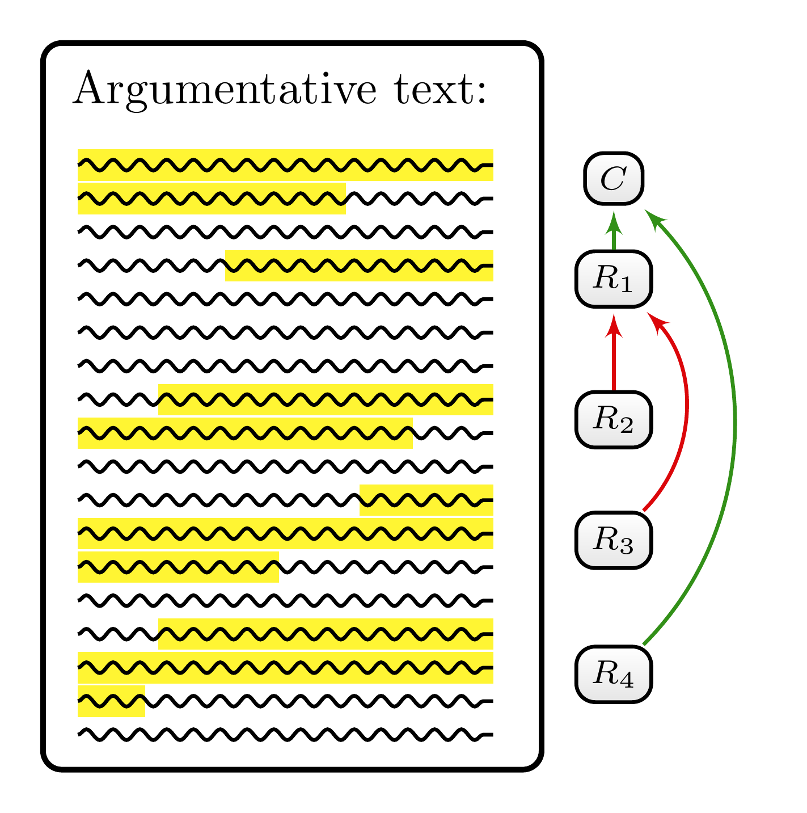
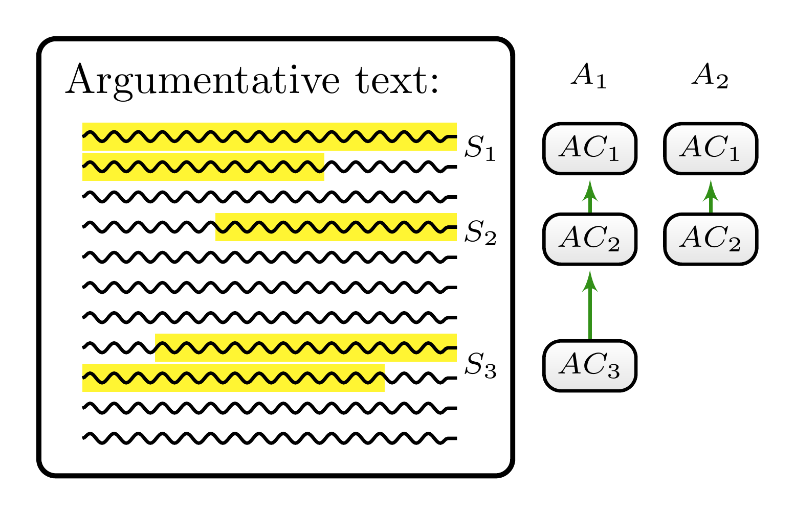
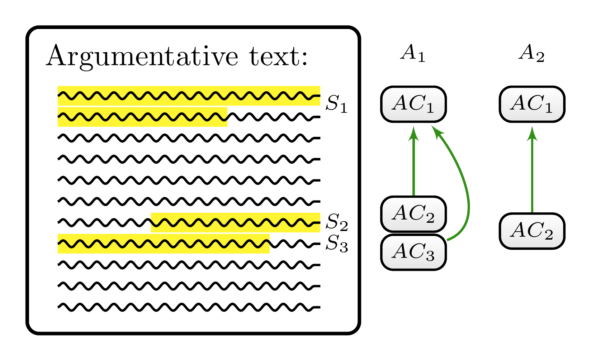
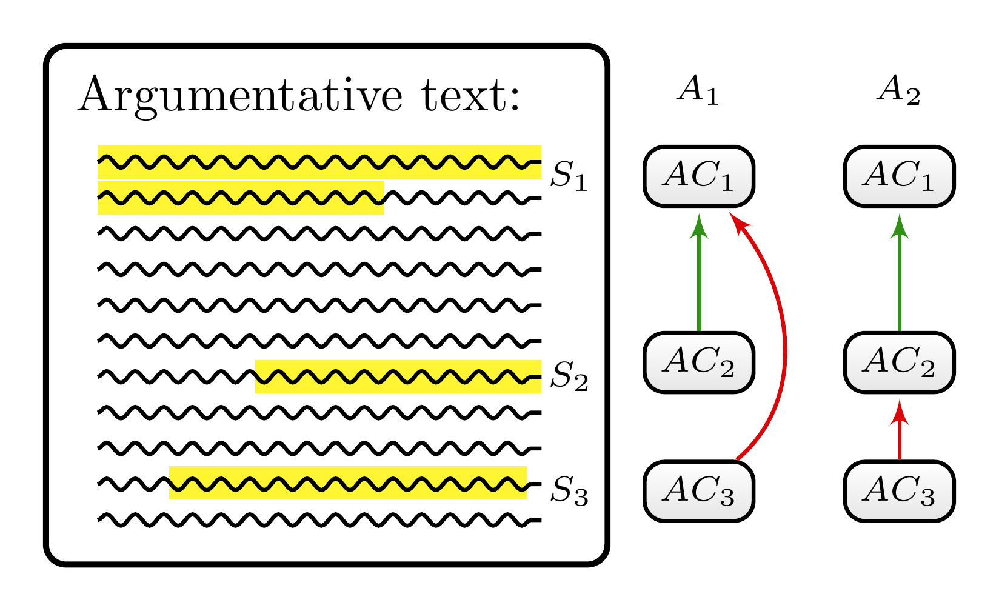

<div align="center">

# 🔎 MAnnoSAS - A Minimalistic Annotation Scheme of Argumentation Structures (v1.0).

[⚙️ Features](#features) •
[🛠️ Usage](#usage) •
[📑 Background](#background) •
[🚧 Further Development](#development)

</div>
<br/>

This repository contains annotation guidelines for a content analysis of argumentation structures that is designed to narrow down the degree of variability between (independently working) annotators. In other words, it is devised to maximise inter-annotator reliability of identifying argumentation structures in text corpora.

The annotation scheme is based on concepts and insights from argumentation theory and minimalistic in the sense that it is parsimonious in the number of introduced categories and theoretical baggage. The design of `MAnnoSAS` is motivated by the following question: How can we employ tools from argumentation theory to minimise the degree of interpretation without requiring annotators to be experts in argumentation theory?


<!-- 
ToDo: What about the "technical features" of the annotations scheme? (free segmentation, etc.) 
-->
<h2 id="features">⚙️ Features</h2>

`MAnnoSAS`:

1. is designed to analyse argumentation structure with a **focus on macrostructure**
2. in annotation studies with **(free) unitizing**,
2. is grounded on **relational categories only**,
3. is based on a **non-reconstructive analysis** of arguments and 
4. **can be complemented** with additional categories and analytical tools.

### 1. Focus on Macrostructure

`MAnnoSAS` is confined to the analysis of argumentation structure&mdash;that is, the identification of expressed argumentative components (reasons, arguments, objetions, refutations, etc.). It will, for instance, not address rhetorical power, style, persuasiveness or literary merit. Additionally, the category system will abstract away from dialogical aspects of argumentation. In particular, it is not concerned with who maintains which stance, who puts forward which argument or who tries to persuade whom. The aim is to distinguish mere structural properties of argumentation from other aspects strictly. It is, of course, possible to later introduce additional categories that account for these features.

### 2. Free Unitizing

The challenges `MAnnoSAS` was designed to meet (see [📑 Background](#background)) occur in annotation contexts where annotators have to unitize the corpus by themselves (*free unitizing*)&mdash;that is, contexts where annotators have to identify the start and end points of argumentative units (coding units). If, instead, coding units are predetermined, `MAnnoSAS` might not provide any advantage over other annotation schemes.

### 3. Relational Categories

`MAnnoSAS`'s category system is confined to relational categories between text segments since all relevant argumentative components (reasons, objections, premises, conclusions, assumption, etc.) are relational. They categorise a text segment as having a justificatory role for another text segment.

The annotation scheme is based on **two justificatory relations: a support relation and an attack relation**. The idea is that many important natural-language concepts relevant for analysing argumentation structure can be captured with this simplistic model:

+ y being presented as a *reason or an argument* for x will be modelled with a support relation between y and x,
+ y being presented as an *objection to or refutation* of x will be modelled by an attack relation between y and x, 
+ z being presented as a *rebutting defeater* of the justification of x by y will be modelled by an attack relation between z and x, 
+ z being presented as an *undermining defeater* of the justification of x by y will be modelled by an attack relation between z and y.

The annotation scheme does not introduce further subcategories of justificatory relations besides the attack and support relation. In particular, it does not contain categories that further qualify the intended probative force of support and attack relations. Additionally, it does not distinguish between undercutting and undermining defeaters.

The result of a `MAnnoSAS`-guided annotation can be visualized with a reason map as illustrated by the schematic example in Figure 1. There are five annotated text segments: The first text segment represents the main claim ($C$), which is supported by two reasons that are formulated by the second ($R_1$) and the fifth text segment ($R_4$). Both the third ($R_2$) and the fourth text segment ($R_3$) represent reasons against&mdash;that is, objections to the supporting reason $R_1$.

<div style="text-align:center;">
<figure>
    
    <figcaption><b>Figure 1:</b> A schematic example of annotating the argumentation structure of an argumentative text. The annotated structure is visualized as an argument map.</figcaption>
</figure>
</div>


### 4. Non-Reconstructive Analysis

`MAnnoSAS` does not demand a reconstructive analysis of argumentation. Annotators are not asked to transform arguments they find into an explicit premise-conclusion structure. Such a design decision can be motivated by pragmatic considerations. The reconstruction of arguments is time-consuming and demands extensive training. The content analyst has to decide in their specific research context whether a reconstructive analysis is necessary and worth the effort.

### 5. Complementing `MAnnoSAS`

`MAnnoSAS` ca be used as a starting point to devise a more ambitious annotation scheme. The bare structural analysis of the suggested annotation scheme can be extended with topical features of argumentative units by introducing subcategories that distinguish between different types of argumentative units. In this way, the researcher could, for instance, 

+ categorise reasons according to argument schemes and assess what type of argumentation occurs (how often), 
+ introduce evaluative subcategories that assess, for instance, argument strength or rhetorical style of reasons and whole argumentations, or  
+ annotate dialectical aspects based on categories that track the genesis and the authors of reasons.

<h2 id="usage">🛠️ Usage</h2>

`MAnnoSAS` was intended to be used within a context of *reliability-orientated* content analysis (of argumentation structures). If you want to stick to such a design, you should consider the following instructions:

+ Content analysts should not themeselve annotate the corpus in question. Especially, if they complemented or revised the annotation scheme. 
+ Instead, they should appoint annotators and instruct them according to a standardized instruction regime. For instance, one simple instructions scheme is to let annotators read the annotation instructions (). More elaborate instruction regime might involve further training sessions. For reproduicibility, it is important that the instruction regime is transparently documented.
+ You should use more than one annotator and assess inter-annotator reliability. 


Some of the instructions correspond to *technical decisions*, which presuppose some features of the used annotation software:

+ For the annotation of implicit claims the annotator should be provided with pseudo-labels that can be used to annotate relations between the implicit claim and other argumentative components (see XXX {#sec-faq-nine}). 


### Citing

If you use `MAnnoSAS` in an annotation study, please cite this works as, for instance:

> Cacean, S. (2024). *MAnnoSAS - A Minimalistic Annotation Scheme of Argumentation Structures (v1.0)*. <https://doi.org/xxx>


BibTex citation:

```bibtex
@article{cacean_xxx,
  title = {MAnnoSAS - A Minimalistic Annotation Scheme of Argumentation Structures (v1.0)},
  author = {Cacean, Sebastian},
  year = {2024},
  month = december,
  doi = {xxx},
  langid = {english},
  url = {xxx},
}
```


### Credits

This annotation scheme was part of my PdD Thesis *"Content Analysis of Argumentation Structures - The Role of Reliability in Argument Mapping"*. 


<h2 id="background">📑 Background</h2>

The analysis of natural-language argumentation involves a systematic study of texts, which includes the identification of argumentative components and their connecting justificatory relations. Usually, this task requires the consideration of semantical and pragmatic aspects that cannot be read mechanically from the text but demand considering co-text, background knowledge of annotators (qua them being competent speakers) and additional extra-linguistic context information. Consequently and as emphasised by argumentation theorists, the analysis of natural-language argumentation is a hermeneutical process, and the results are an interpretation, which can differ between independently working annotators. Such interpretational indedeterminacies can result in low realibilities. 

`MAnnoSAS` was designed to minimize these interpretational indeterminacies&mdash;though it won't establish unique interpretations in all cases. There will be argumentative texts which allow more than on correct annotation of their argumentation structure (w.r.t. the given explication in `MAnnoSAS`). 

In particular, it provides guidance with respect to the following types of ambiguity:

### Node Ambiguity

Annotators might come to different conclusions as to whether a particular text segment expresses an argumentative component, in other words, whether it is intended as justificatory relevant. For instance, one annotator might interpret some text segment as intended as an argument, whereas another as something else, say, a mere illustration with no argumentative relevance (as exemplified in Figure 2). 

<div align="center">
<figure>
    
    <figcaption><b>Figure 2:</b> An abstract illustration of <em>node ambiguity</em>. In contrast to A<sub>1</sub>, the annotator A<sub>2</sub> does not interpret the text segment S<sub>3</sub> as an argumentative unit.</figcaption>
</figure>
</div>

To miminize node ambiguity `MAnnoSAS` covers the following aspects:

+ How can we use cotext and linguistic cues to identify argumentative units?
+ How do you tell apart justificatory and explanatory reasons?
+ Are examples considered as reason? Under which conditions?

### Underdetermination of Granularisation

Annotators have to identify text segments corresponding to argumentative components; in particular, they must decide where they start and end. As a consequence, annotators might disagree on the number of argumentative components expressed in a particular text segment. For instance, one analyst might interpret the text segment as expressing one
reason, whereas the other identifies two (as exemplified in Figure 3).

<div align="center">
<figure>
    
    <figcaption><b>Figure 3:</b> An abstract illustration of <em>underdetermination of granularisation</em>. Annotator A<sub>1</sub> interprets S<sub>2</sub> and S<sub>3</sub> as two distinct argumentative components (their AC<sub>2</sub> and AC<sub>3</sub> ) and annotator A<sub>2</sub> interprets them as one compound argumentative component (their AC<sub>2</sub>).</figcaption>
</figure>
</div>

To miminize granularisation ambiguity `MAnnoSAS` covers the following aspects:

+ Can two contiguous text segments express more than one reason? How do we decide in these cases on the number of reasons?^[The individuation of reasons in `MAnnoSAS` is based on a criterion, which I borrowed from Freeman, J. B. (2011). *Argument Structure: Representation and Theory.* Dordrecht: Springer.]
+ How do we deal with reformulations of the same point or reason? Are they considered as different reason or do they belong to the reason they reformulate? What if reformulations express clarifications or provide illustrative examples?
+ Can one argumentative component be scattered over non-contiguous text segments?  

### Relation Ambiguity

Finally, annotators might disagree in their analysis of the intended justificatory relations between argumentative units. For instance, two analysts might interpret a specific text segment as expressing an objection but disagree on the target of the objection (as exemplified in Figure 4).


<div align="center">
<figure>
    
    <figcaption><b>Figure 4:</b> An abstract illustration of <em>relation ambiguity</em> Analyst A<sub>1</sub> interprets S<sub>3</sub> as expressing an objection against S<sub>1</sub> and and analyst A<sub>2</sub> interprets it as expressing an objection against S<sub>2</sub>.</figcaption>
</figure>
</div>

<h2 id="development">🚧 Further Development</h2>

`MAnnoSAS` (v1.0) will be subject to further improvements (which will be published in new versions). If you have feedback and suggestions to improve the annotation scheme, feel free to open an issues and/or create a pull request. 

<!--
### Known Issues/Caveats
-->


---

<!--
[](https://doi.org/10.5281/zenodo.13294165)
-->
[![CC BY 4.0][cc-by-shield]][cc-by]

This work is licensed under a
[Creative Commons Attribution 4.0 International License][cc-by].

[![CC BY 4.0][cc-by-image]][cc-by]

[cc-by]: http://creativecommons.org/licenses/by/4.0/
[cc-by-image]: https://i.creativecommons.org/l/by/4.0/88x31.png
[cc-by-shield]: https://img.shields.io/badge/License-CC%20BY%204.0-lightgrey.svg
