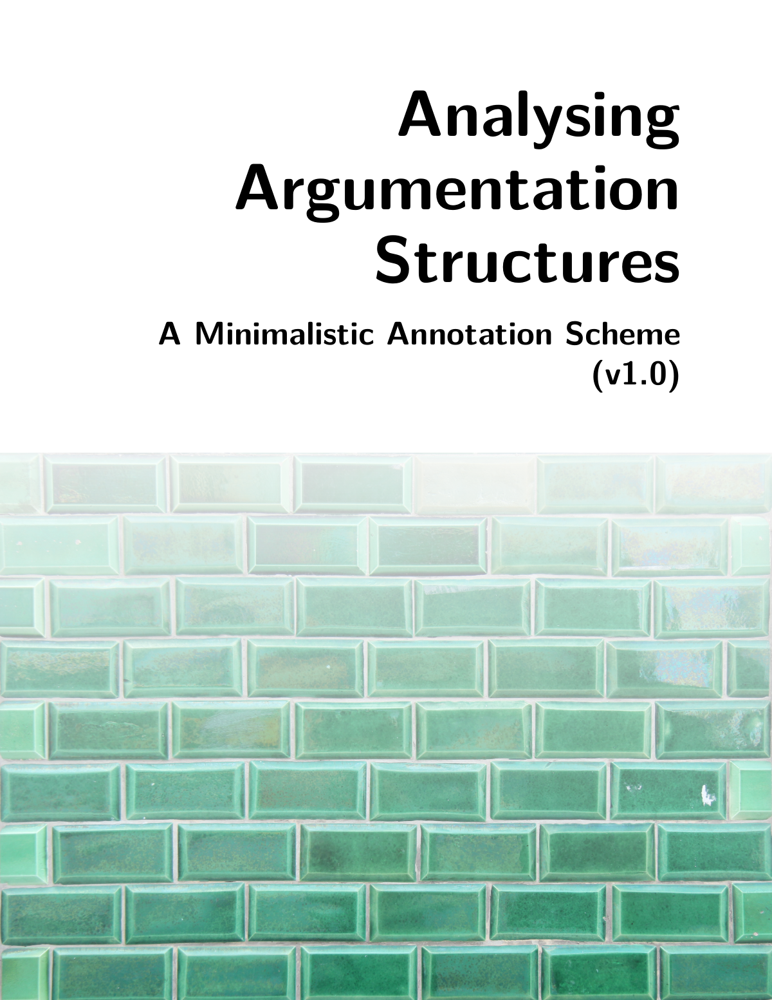

# Overview {.unnumbered}

<a href="./Analysing-Argumentation-Structures.pdf" target="_blank">
  
</a>

This website contains `MAnnoSAS`, a minimalistic annotation scheme for argumentation structures. The annotation scheme is designed to narrow the degree of variability among (independently working) annotators. In other words, it helps to increase inter-annotator reliability when identifying argumentation structures.

The annotation scheme is based on concepts and insights from argumentation theory. It is minimalistic in the sense that it is parsimonious in the number of categories introduced and the theoretical baggage. The design of this scheme is motivated by the following question: How can we employ tools from argumentation theory to minimise the degree of interpretation without requiring annotators to be experts in argumentation theory?

Important **context information about aims, scope and intended use of this annotation scheme** can be found under <https://github.com/xylomorph/mannosas>.
<div style="clear:both;"></div>

## License

This work is licensed under a
[Creative Commons Attribution 4.0 International License][cc-by].

[![CC BY 4.0][cc-by-image]][cc-by]

[cc-by]: http://creativecommons.org/licenses/by/4.0/
[cc-by-image]: https://i.creativecommons.org/l/by/4.0/88x31.png
[cc-by-shield]: https://img.shields.io/badge/License-CC%20BY%204.0-lightgrey.svg

## Citation

BibTeX citation:

```bibtex
@article{cacean_2026,
  title = {Analysing Argumentation Structures - A Minimalistic Annotation Scheme.},
  author = {Cacean, Sebastian},
  year = {2026},
  month = september,
  doi = {10.5281/zenodo.22709968},
  langid = {english},
  url = {https://sebastiancacean.de/mannosas/},
}
```


::: {.callout-note icon=false}

## For attribution, please cite this works as, for instance:

Cacean, S. (2026). *Analysing Argumentation Structures - A Minimalistic Annotation Scheme.* <https://doi.org/10.5281/zenodo.22709968>
:::

## Credits

`MAnnoSAS` (v1.0) was developed as part of my PhD Thesis [*"Content Analysis of Argumentation Structures - The Role of Reliability in Argument Mapping"*](https://doi.org/10.5445/IR/1000182475).

## Further Development

`MAnnoSAS` (v1.0) will be subject to further improvements (which will be published in new versions). If you have feedback and suggestions to improve the annotation scheme, feel free to open a GitHub issue and/or create a pull request. 
